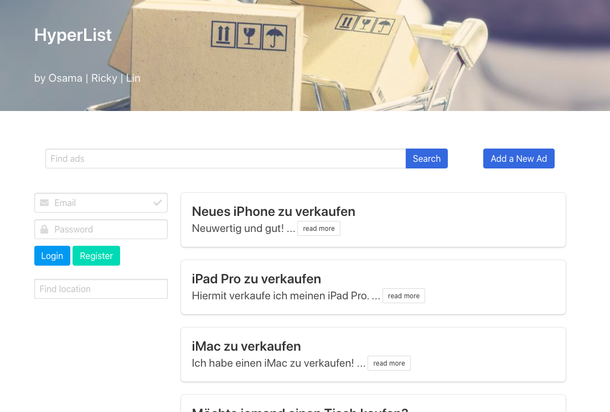

# HyperList

## Description

"HyperList" is a complete React front-end client for a classified ads platform. It includes all the essential features - add, edit, delete, mark as favorite and also exchange messages with other users. It also includes login and register functionalities. "HyperList" is our mid-term project in an intense 3-months bootcamp on JavaScript. The REST-API back-end has been provided for us. This project is the sequel of the former project "SuperList" ([here](https://github.com/RyanLinXiang/superlist)).



Below you can find an example of "HyperList" running. It shows how to open a full-item view, to mark an ad as favorite and to open the favorite view.


### Dependencies

```
package.json
```

### Installing

```
npm install
```

### Executing program

```
npm start
```

## Authors

* Lin Xiang (Layout and CRUD front-end implementation)
* Ricky Duncan-Williams (Authentification)
* Osama Alhaj-Khaled (Search)

